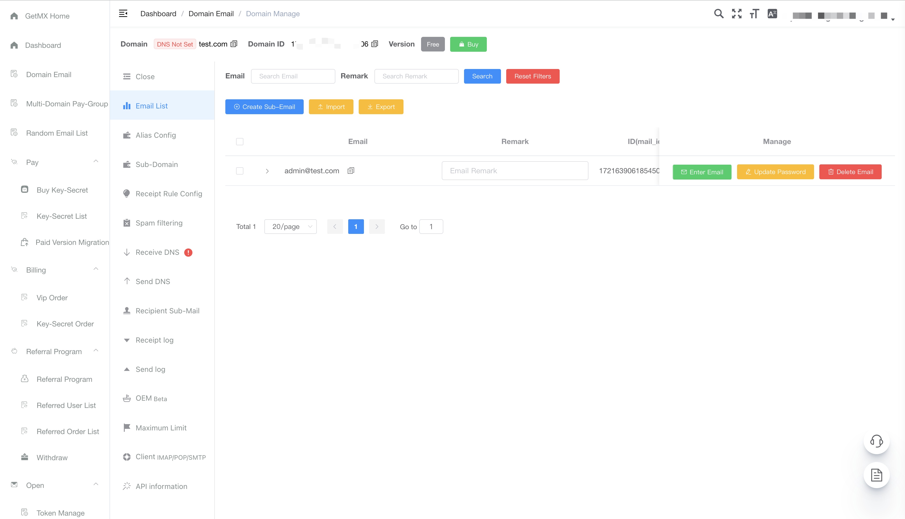

### What is GetMX

GetMX Domain-Email is a service provider specializing in bulk domain email registration, random email generation, and multi-account management for both businesses and individuals. By selecting a service region, you can create corporate domain emails for various countries and enable email sending and receiving functionalities.

### Website Links

- [Official Website](https://getmx.com)
- [Help Documentation](https://docs.getmx.com)
- [Web Client](https://mail-client.getmx.com)
  
### Advantages of GetMX

1. Unlimited Email Accounts

Supports one-click email forwarding activation. For example, if the domain is getmx.com, you can have an unlimited number of email accounts like dev@getmx.com, test@getmx.com, whatsapp@getmx.com, etc.

2. Unlimited Subdomains

By enabling subdomain forwarding, you can not only configure email for the main domain but also instantly own countless subdomain emails. For instance, if the domain is getmx.com, you will have email accounts like dev@mail.getmx.com, test@tiktok.getmx.com, whatsapp@dev.getmx.com, etc.

3. Set Email Region

Supports setting the recipient region to different countries, such as the USA, Singapore, China, Japan, Russia, Australia, London, Bahrain, South Africa, and more. Server regions can be switched with one click, allowing the email to quickly switch to different regions.

4. Support for Nearly All Platforms

Supports receiving emails from almost all platforms, including Facebook, TikTok, Twitter, Google, PayPal, and more.

5. API Support

Comprehensive API interface supports HTTP requests/IMAP/POP, batch email creation, and reading email content.

6. Excellent Customer Support

Not sure how to configure domain email DNS? There are detailed video tutorials available. If you still have issues, customer support can help with remote configuration.

7. OEM Branding Customization

Allows custom domain access to the web version, customizing the login page, including promotional text, images, and corporate logos, enhancing corporate image and brand exposure.

8. Multilingual Support

GetMX supports multiple languages, allowing you to use GetMX in the language you are most comfortable with, including English, French, Japanese, Chinese, German, Spanish, Russian, Ukrainian, Portuguese, Dutch, Turkish, Swedish, and Norwegian.

#### Team Permissions

Set permissions for the team with various rules: sub-accounts, custom forwarding rules, independent subdomains, independent domains, and more ways to create permissions.

### GetMX Compared to ForwardMX/ImprovMX

GetMX differs from forwarding email services. ForwardMX/ImprovMX only handles email forwarding via cheap bandwidth to the email address you set. However, this has drawbacks: receiving too many emails may cause rejection, leading to lost emails, which can significantly impact business. Once an email is rejected, the sender may never attempt to resend, causing lost accounts registered with those emails on platforms like Facebook, TikTok, Twitter, Google, PayPal, etc. Many users have migrated from ForwardMX/ImprovMX to GetMX due to this issue, but the consequence of being unable to receive emails is irreversible.

### Video Tutorials
- [How to Purchase a Domain on GoDaddy](https://youtu.be/UL6ELt46HsI)
- [How to Configure DNS on CloudFlare](https://youtu.be/HkQdgdyGac0)
- [How to Configure DNS on GoDaddy](https://youtu.be/0iUUg0Qa5N8)
- [What is Forwarding and How to Configure It](https://youtu.be/KSr1BQ39sAA)

### GetMX is Not a Temporary Email Service!!!

We also provide free random emails, which can be created in multiple numbers. Note that these are not temporary or 10-minute emails. They are like Gmail, Outlook, Hotmail, Yahoo, etc. Emails created in the backend can be used permanently.

### Target Audience
- Businesses
- Website Owners
- Independent Developers
- Foreign Trade Professionals

### Contact Support
For any issues, including email usage, DNS configuration, domain purchasing, etc., you can contact customer support.

