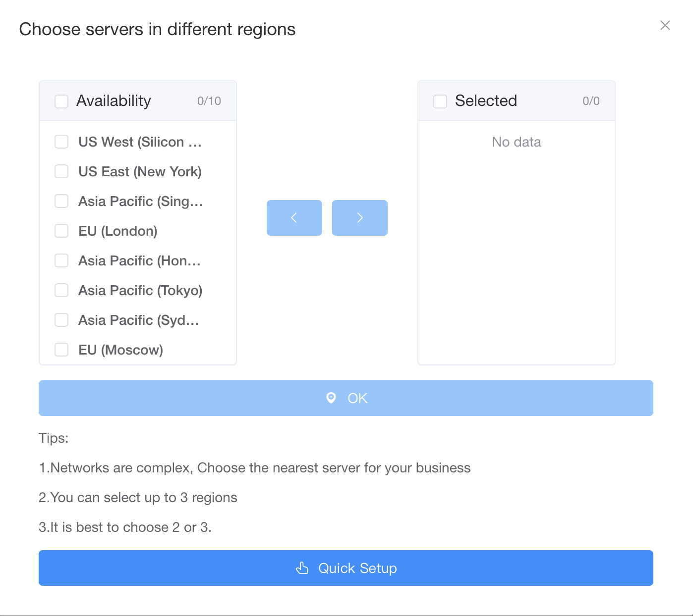

  <a href="readme.md">English</a> |
  日本語 |
  <a href="readme_de.md">Deutsch</a> |
  <a href="readme_es.md">Español</a> |
  <a href="readme_fr.md">Français</a> |
  <a href="readme_nb_no.md">Bokmål</a> |
  <a href="readme_nl_nl.md">Nederlands</a> |
  <a href="readme_pt_br.md">Português</a> |
  <a href="readme_ru.md">Россия</a> |
  <a href="readme_sv_se.md">Svenska</a> |
  <a href="readme_tr.md">Türkiye</a> |
  <a href="readme_uk_ua.md">Україна</a> |
  <a href="readme_zh_cn.md">简体中文</a> |
  <a href="readme_zh_tw.md">繁體中文</a>

# GetMX について

GetMXドメインメールは、企業や個人向けに大量のドメインメールアドレス登録、ランダムメールアドレス、複数アカウント管理サービスを提供する専門のドメインメールサービスプロバイダーです。サービス地域を選択することで、各国の企業ドメインメールアドレスを作成し、メールの送受信機能を実現します。

## ウェブサイトリンク

- [公式サイト](https://getmx.com)
- [ヘルプドキュメント](https://docs.getmx.com)
- [ウェブクライアント](https://mail-client.getmx.com)

## GetMXの利点

1. **無制限のメールアドレス**
   メール代理受信のワンクリック有効化をサポートします。例：ドメインが getmx.com の場合、dev@getmx.com、test@getmx.com、whatesapp@getmx.com など、無制限のメールアドレスを所有できます。

2. **無制限のサブドメイン**
   サブドメインの代理受信を有効にすることで、メインドメインのメールアドレスだけでなく、無数のサブドメインも一度に所有できます。例：ドメインが getmx.com の場合、dev@mail.getmx.com、test@tiktok.getmx.com、whatesapp@dev.getmx.com など、無制限のサブドメインメールアドレスを所有できます。

3. **メールボックスの国設定**
   受信地域を異なる国に設定できます。アメリカ、シンガポール、中国、日本、ロシア、オーストラリア、ロンドン、バーレーン、南アフリカなど、多地域サービスをサポートし、サーバー地域のワンクリック切り替えが可能です。メールボックスを異なる地域に素早く切り替えられます。

4. **ほぼすべてのプラットフォームでのメール受信をサポート**
   Facebook/TikTok/Twitter/Google/PayPalなど、ほぼすべてのプラットフォームでのメール受信をサポートしています。

5. **API サポート**
   完全なAPIインターフェース、HTTP リクエスト/IMAP/POP をサポートし、メールボックスの一括作成、メール内容の読み取りが可能です。

6. **包括的なカスタマーサポート**
   ドメインメールのDNS設定方法がわからない場合は、詳細なビデオチュートリアルがあります。それでも分からない場合は、カスタマーサポートにリモート設定を依頼できます。

7. **OEMブランドカスタマイズ**
   ウェブ版へのアクセスにカスタムドメインを使用でき、ログインページのプロモーションテキスト、画像、企業ロゴなどをカスタマイズして、企業イメージを強化し、ブランド露出度を高めることができます。

8. **多言語サポート**
   GetMXは複数の言語をサポートしており、英語、フランス語、日本語、中国語、ドイツ語、スペイン語、ロシア語、ウクライナ語、ポルトガル語、オランダ語、トルコ語、スウェーデン語、ノルウェー語など、お好みの言語でGetMXをすぐに利用できます。

### チーム権限
サブアカウント、カスタム代理受信ルール、独立したサブドメイン、独立したドメインなど、さまざまな方法でチームの権限を設定できます。

## GetMX vs ForwardMX/ImprovMXなど

GetMXは転送型メールボックスとは異なります。ForwardMX/ImprovMXはメール中継のみを行い、安価な帯域幅を使用してメールを設定したメールボックスに転送します。しかし、これには欠点があります：多くのメールを受信すると拒否され、メールが頻繁に紛失する可能性があります。これはビジネスに大きな影響を与え、一度拒否されると送信者が再びメールを送信しなくなる可能性があります。多くの人々がこれが原因でFacebook/TikTok/Twitter/Google/PayPalアカウントを失い、ForwardMX/ImprovMXからGetMXに移行しましたが、メールが受信できなくなった結果は不可逆的です。

## ビデオチュートリアル

- [Godaddyでドメインを購入する方法](https://youtu.be/UL6ELt46HsI)
- [CloudFlareでDNSを設定する方法](https://youtu.be/HkQdgdyGac0)
- [GodaddyでDNSを設定する方法](https://youtu.be/0iUUg0Qa5N8)
- [代理受信とは何か、どのように設定するか](https://youtu.be/KSr1BQ39sAA)

## GetMXは一時的なメールボックスではありません！

無料のランダムメールボックスも提供しており、複数作成できます。これは一時的なメールボックス/10分メールボックスではなく、Gmail/Outlook/Hotmail/Yahooと同様に、バックエンドで作成されたメールボックスは永続的に使用できます。

## 適した対象者

- 企業
- ウェブサイト所有者
- 独立開発者
- 貿易業界の従事者

## カスタマーサポートへの連絡

メールボックスの使用、DNS設定、ドメイン購入など、使用に関する問題があれば、カスタマーサポートにお問い合わせください。

