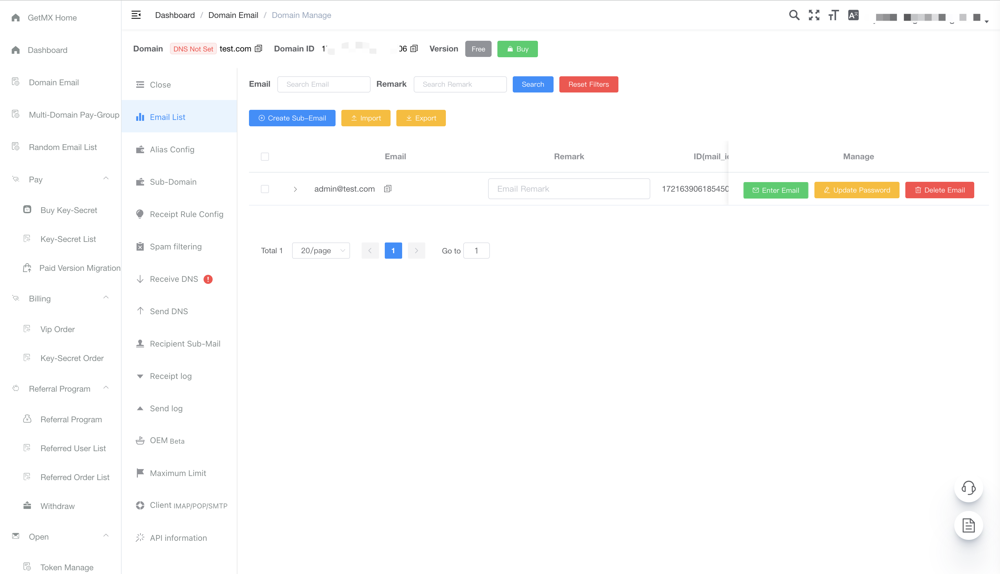
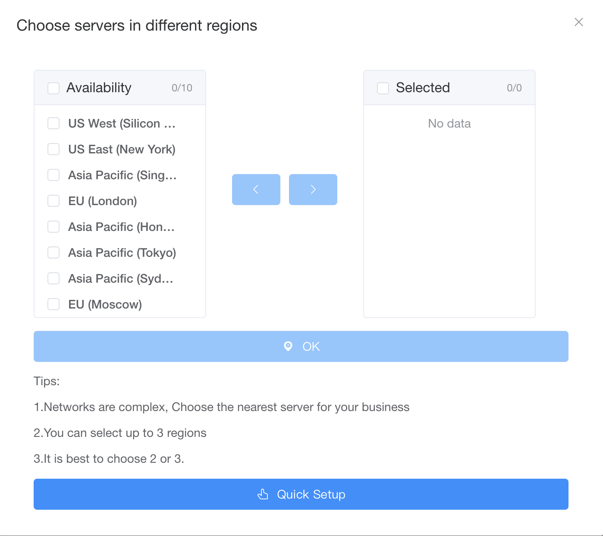

  <a href="readme.md">English</a> |
  <a href="readme_ja.md">日本語</a> |
  <a href="readme_de.md">Deutsch</a> |
  <a href="readme_es.md">Español</a> |
  <a href="readme_fr.md">Français</a> |
  <a href="readme_nb_no.md">Bokmål</a> |
  <a href="readme_nl_nl.md">Nederlands</a> |
  <a href="readme_pt_br.md">Português</a> |
  Россия |
  <a href="readme_sv_se.md">Svenska</a> |
  <a href="readme_tr.md">Türkiye</a> |
  <a href="readme_uk_ua.md">Україна</a> |
  <a href="readme_zh_cn.md">简体中文</a> |
  <a href="readme_zh_tw.md">繁體中文</a>

# GetMX

GetMX Domain-Email - это поставщик услуг доменной электронной почты, специализирующийся на массовой регистрации доменных адресов электронной почты, случайных адресов электронной почты и управлении несколькими учетными записями для предприятий и частных лиц. Создавайте корпоративные доменные адреса электронной почты в разных странах, выбирая регион обслуживания, для отправки и получения электронной почты.

## Ссылки на сайт

- [Официальный сайт](https://getmx.com)
- [Документация](https://docs.getmx.com)
- [Веб-клиент](https://mail-client.getmx.com)

## Преимущества GetMX

1. Неограниченное количество адресов электронной почты

Поддержка одноключевого включения перехвата почты. Например, если ваш домен - getmx.com, вы получаете неограниченное количество адресов электронной почты, таких как dev@getmx.com, test@getmx.com, whatsapp@getmx.com и т.д.

2. Неограниченное количество поддоменов

Включив перехват поддоменов, вы можете не только настроить адреса электронной почты для основного домена, но и мгновенно получить бесконечное количество поддоменов. Например, если ваш домен - getmx.com, вы получите неограниченное количество адресов электронной почты поддоменов, таких как dev@mail.getmx.com, test@tiktok.getmx.com, whatsapp@dev.getmx.com и т.д.

3. Настройка страны для электронной почты

Поддержка настройки разных стран для области получения почты, включая США, Сингапур, Китай, Японию, Россию, Австралию, Лондон, Бахрейн, Южную Африку и другие регионы. Мгновенное и свободное переключение между регионами серверов, возможность быстрого переключения почтового ящика между различными регионами.

4. Поддержка получения почты практически со всех платформ

Поддержка получения электронной почты от Facebook, TikTok, Twitter, Google, PayPal и практически всех других платформ.

5. Поддержка API

Полноценный API интерфейс с поддержкой HTTP-запросов, IMAP и POP, для массового создания почтовых ящиков и чтения содержимого электронной почты.

6. Комплексная поддержка клиентов

Не знаете, как настроить DNS для доменной электронной почты? Доступны подробные видеоуроки. Если все еще возникают трудности, служба поддержки поможет с удаленной настройкой.

7. Настройка OEM-бренда

Возможность настройки доступа к веб-версии через собственный домен, персонализация страницы входа, включая рекламный текст, изображения, логотип компании и т.д., для усиления корпоративного имиджа и повышения узнаваемости бренда.

8. Многоязычная поддержка

GetMX поддерживает множество языков, позволяя вам быстро использовать GetMX на знакомом вам языке. Поддерживаемые языки включают английский, французский, японский, китайский, немецкий, испанский, русский, украинский, португальский, голландский, турецкий, шведский и норвежский.

### Командные разрешения

Различные правила для настройки разрешений для команды: субаккаунты, настраиваемые правила перехвата, независимые поддомены, независимые домены и другие способы создания разрешений.

## GetMX в сравнении с ForwardMX/ImprovMX и другими

GetMX отличается от сервисов пересылки электронной почты. ForwardMX/ImprovMX только перенаправляют почту, используя дешевые широкополосные соединения для пересылки писем на указанный вами адрес. Однако у этого подхода есть недостатки: при получении большого количества писем может происходить отказ в приеме, а также частая потеря писем. Это может серьезно повлиять на бизнес, так как из-за политики отправителя, после отказа в приеме, отправитель может больше никогда не отправить письмо. Многие люди потеряли свои учетные записи Facebook/TikTok/Twitter/Google/PayPal, зарегистрированные на эти адреса электронной почты. Многие пользователи перешли с ForwardMX/ImprovMX на GetMX из-за этого, но последствия неполучения писем необратимы.

## Видеоуроки

- [Как купить домен на Godaddy](https://youtu.be/UL6ELt46HsI)
- [Как настроить DNS на CloudFlare](https://youtu.be/HkQdgdyGac0)
- [Как настроить DNS на Godaddy](https://youtu.be/0iUUg0Qa5N8)
- [Что такое перехват и как его настроить](https://youtu.be/KSr1BQ39sAA)

## GetMX - это не временная электронная почта!

Мы также предоставляем бесплатные случайные адреса электронной почты, которых можно создать несколько. Обратите внимание, что это не временные почтовые ящики или 10-минутные почтовые ящики. Они аналогичны Gmail/Outlook/Hotmail/Yahoo и могут использоваться постоянно после создания в панели управления.

## Для кого подходит

- Предприятия
- Владельцы веб-сайтов
- Независимые разработчики
- Специалисты в сфере внешней торговли

## Связь со службой поддержки

По любым вопросам использования можно обратиться в службу поддержки, включая проблемы с использованием электронной почты, настройкой DNS, покупкой доменов и т.д.

