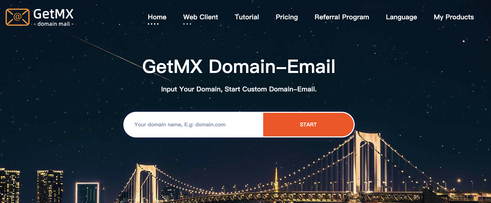

  <a href="readme.md">English</a> |
  <a href="readme_ja.md">日本語</a> |
  <a href="readme_de.md">Deutsch</a> |
  <a href="readme_es.md">Español</a> |
  <a href="readme_fr.md">Français</a> |
  <a href="readme_nb_no.md">Bokmål</a> |
  <a href="readme_nl_nl.md">Nederlands</a> |
  <a href="readme_pt_br.md">Português</a> |
  <a href="readme_ru.md">Россия</a> |
  <a href="readme_sv_se.md">Svenska</a> |
  <a href="readme_tr.md">Türkiye</a> |
  <a href="readme_uk_ua.md">Україна</a> |
  <a href="readme_zh_cn.md">简体中文</a> |
  繁體中文

### GetMX是什麼

GetMX Domain-Email 是一個專門為企業/個人提供批量註冊域名信箱、隨機信箱以及多帳號管理服務的域名信箱服務商。透過選擇服務地域，創建各個國家的企業域名信箱，實現郵件收發功能。

### 網站連結

- [官網](https://getmx.com)

- [幫助文件](https://docs.getmx.com)

- [網頁客戶端](https://mail-client.getmx.com)

### GetMX的優勢

1. 無數個信箱帳號

支援一鍵開啟信箱代收，例如：域名是 getmx.com，將擁有 dev@getmx.com、test@getmx.com、whatesapp@getmx.com 等無數個信箱帳號。

2. 無數個子域名

透過開啟子域名代收，不但可以配置主域名的信箱，還能一鍵擁有無數個子域名，例如：域名是 getmx.com，將擁有 dev@mail.getmx.com、test@tiktok.getmx.com、whatesapp@dev.getmx.com 等無數個子域名信箱帳號。

3. 設定信箱國家

支援將收件區域設定不同的國家，比如美國、新加坡、中國、日本、俄羅斯、澳大利亞、倫敦、巴林、南非等多地域服務，伺服器地區一鍵、自由切換，信箱可以快速切換到不同的地區。

4. 支援幾乎所有的平台接收郵件

支援 Facebook/Tiktok/Twitter/Google/Paypal 等幾乎所有平台接收郵件。

5. API 支援

完善的 API 接口，支援 http 請求/IMAP/POP，批量創建信箱，讀取郵件內容。

6. 完善的客服

不會配置域名信箱 DNS 解析？有詳細的視頻教程講解，仍然不會，聯繫客服遠端配置。

7. OEM 品牌定制

可以自定義域名訪問網頁版，定制登錄頁面包括宣傳文字、圖片，企業 LOGO 等，增強企業形象，提升品牌曝光度。

8. 多語言支援

GetMX 支援多種語言，您可以選擇自己熟悉的語言快速應用 GetMX，包含英語、法語、日語、中文、德語、西班牙語、俄語、烏克蘭語、葡萄牙語、荷蘭語、土耳其語、瑞典語、挪威語。

#### 團隊權限

多種規則給團隊設置權限：子帳號，定制代收規則，獨立子域名，獨立域名等多種方式創建權限。

### GetMX 對比 ForwardMX/ImprovMX 等

GetMX 和轉發類信箱不同，ForwardMX/ImprovMX 只做信箱中轉，透過廉價的寬帶將郵件轉發到您設置的信箱。但是這樣有的缺點：收多了郵件會拒收郵件，並且會經常丟郵件，這對業務影響非常大，因為發件方的策略，一旦拒收很可能發件方就在也不會發送郵件了，有很多人因此丟失了用他們信箱註冊的 Facebook/Tiktok/Twitter/Google/Paypal 帳號，有很多用戶因此從 ForwardMX/ImprovMX 遷移到了 GetMX，但是產生不能收件的後果是不可逆的。

### 視頻教程

- [如何在 Godaddy 購買域名](https://youtu.be/UL6ELt46HsI)

- [如何在 CloudFlare 配置 DNS 解析](https://youtu.be/HkQdgdyGac0)

- [如何在 Godaddy 配置 DNS 解析](https://youtu.be/0iUUg0Qa5N8)

- [什麼是代收，如何配置代收](https://youtu.be/KSr1BQ39sAA)

### GetMX 不是臨時信箱!!!

我們同時提供了免費的隨機信箱，可以創建多個，注意這個不是臨時信箱/10 分鐘信箱，它和 Gmail/Outlook/Hotmail/Yahoo 是一樣的，在後台創建的信箱可以永久使用。

### 適合人群

- 企業或者

- 網站所有者

- 獨立開發者

- 外貿行業人員

### 聯繫客服

有任何使用問題都可以聯繫客服處理，包括信箱使用問題，配置 DNS 問題，購買域名問題等。

